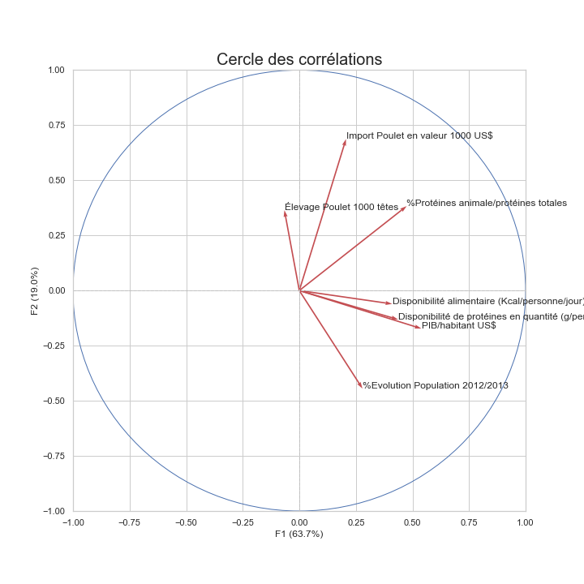

# Projet : Etude de marché, stratégie d'exportation
### Projet du parcours Data Analyst OpenClassrooms en partenariat avec l’ENSAE-ENSAI.
Projet d'étude de marché sur le développement d'une entreprise d'agroalimentaire à l'international.



## Préambule
Pour ce projet, les données ont été manipulées en Python sur support Jupyter Notebook. Opérations de clustering hiérarchique et K-Means, ACP et visualisation des clusters Pays sur le(s) plan(s) factoriel(s), cercle des corrélations. 

### Les données
*Data source* [FAO](http://www.fao.org/faostat/fr/#data)

### Compétences évaluées
 - Construire et lire un dendogramme
 - Tester l’adéquation à une loi par un test statistique
 - Interpréter une ACP


## Prérequis techniques
Si vous n'avez jamais installé **Python**, alors autant installer directement la **distribution Anaconda**.
Anaconda est donc une distribution Python, faite pour la Data Science.

De cette manière on peut installer Python et ses librairies de Data Science Pandas, Matplotlib, Seaborn, Scipy, Numpy etc… 
Mais aussi le notebook Jupyter, qui reste incontournable et vivement recommandé!
C'est par ici : [Anaconda](https://www.anaconda.com/download)

Si vous souhaitez lancer le projet, il sera nécessaire d'installer Jupyter Notebook sur votre mahcine. 
La doc. Jupyter est accessible via : [Jupyter Documentation](https://jupyter.readthedocs.io/en/latest/install.html) 

```
python -m pip install --upgrade pip    
python -m pip install jupyter
```

Pour tester l'installation, vous pouvez taper dans votre console la commande suivante :

```
jupyter notebook
```

### Installation des librairies Python uniquement
*Pour installer python ainsi que les librairies de Data Science, il est fortement recommandé d'installer la distribution Anaconda.* 

```
pip install pandas
pip install matplotlib
pip install numpy
pip install scipy
```

## Auteur

**Nalron** *(Nicolas Pasero)* [Persona](https://nalron.com) - *Initial work* - [Github](https://github.com/nalron)
